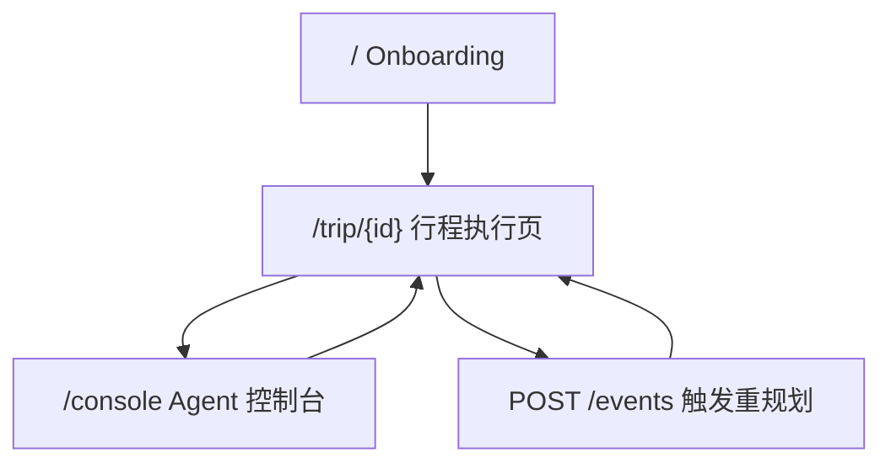
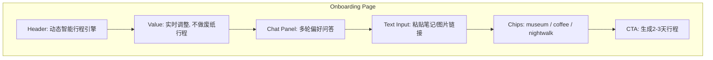
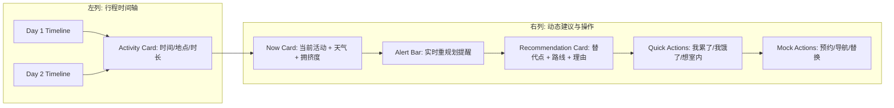
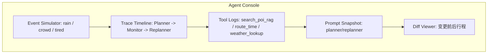
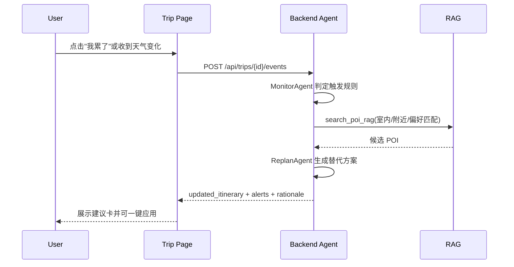

# 动态智能行程引擎 - 低保真原型图

## 1) 页面结构图（IA）

```mermaid
flowchart TB
    A["/ Onboarding"] --> B["/trip/{id} 行程执行页"]
    B --> C["/console Agent 控制台"]
    C --> B
    B --> D["POST /events 触发重规划"]
    D --> B
```

## 2) `/` Onboarding 低保真线框

```mermaid
flowchart TD
    subgraph P1["Onboarding Page"]
        H["Header: 动态智能行程引擎"]
        V["Value: 实时调整, 不做废纸行程"]
        C["Chat Panel: 多轮偏好问答"]
        T["Text Input: 粘贴笔记/图片链接"]
        S["Chips: museum / coffee / nightwalk"]
        G["CTA: 生成2-3天行程"]
    end
    H --> V --> C --> T --> S --> G
```

## 3) `/trip/[id]` 行程页低保真线框

```mermaid
flowchart LR
    subgraph Left["左列: 行程时间轴"]
        D1["Day 1 Timeline"]
        D2["Day 2 Timeline"]
        D3["Activity Card: 时间/地点/时长"]
    end

    subgraph Right["右列: 动态建议与操作"]
        N["Now Card: 当前活动 + 天气 + 拥挤度"]
        A["Alert Bar: 实时重规划提醒"]
        R["Recommendation Card: 替代点 + 路线 + 理由"]
        K["Quick Actions: 我累了/我饿了/想室内"]
        M["Mock Actions: 预约/导航/替换"]
    end

    D1 --> D3
    D2 --> D3
    D3 --> N
    N --> A --> R --> K --> M
```

## 4) `/console` Agent 控制台低保真线框

```mermaid
flowchart TD
    subgraph Console["Agent Console"]
        TL["Trace Timeline: Planner -> Monitor -> Replanner"]
        LOG["Tool Logs: search_poi_rag / route_time / weather_lookup"]
        PM["Prompt Snapshot: planner/replanner"]
        SIM["Event Simulator: rain / crowd / tired"]
        DF["Diff Viewer: 变更前后行程"]
    end
    SIM --> TL --> LOG --> PM --> DF
```

## 5) 核心交互流程（动态重规划）

```mermaid
sequenceDiagram
    participant U as User
    participant T as Trip Page
    participant B as Backend Agent
    participant R as RAG

    U->>T: 点击"我累了"或收到天气变化
    T->>B: POST /api/trips/{id}/events
    B->>B: MonitorAgent 判定触发规则
    B->>R: search_poi_rag(室内/附近/偏好匹配)
    R-->>B: 候选 POI
    B->>B: ReplanAgent 生成替代方案
    B-->>T: updated_itinerary + alerts + rationale
    T-->>U: 展示建议卡并可一键应用
```
